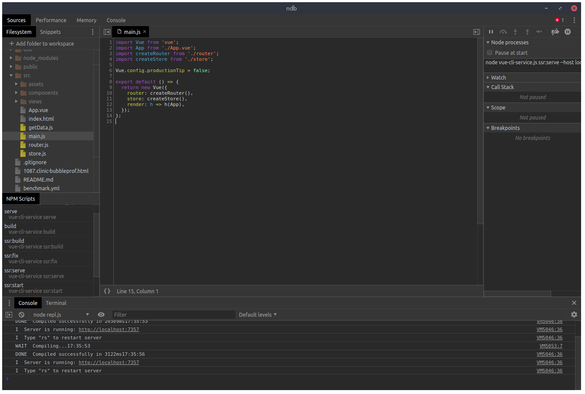
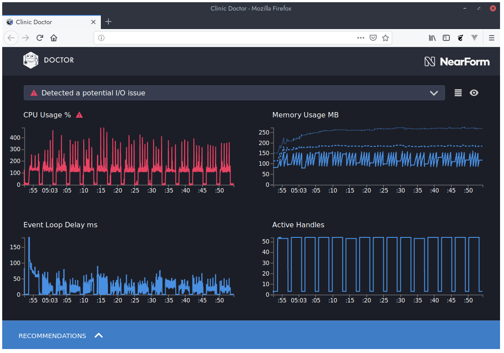
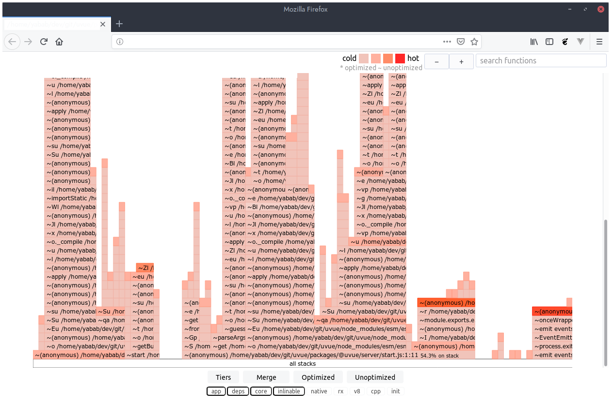
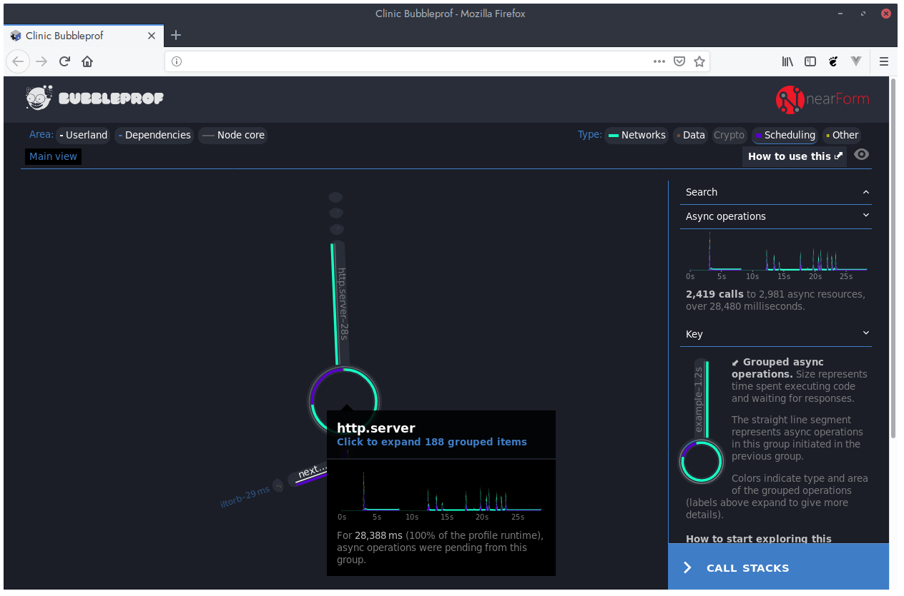

# Dev tools

Dev tools package is just a CLI program to start your SSR app with some utilities.
To install it:

```bash
npm install -D @uvue/devtools
```

**Help output**:

```bash
uvd <cmd> [args]

Commands:
  uvd doctor                Start a node Clinic Doctor against server
  uvd flame                 Start a node Clinic Flame against server
  uvd bubbleprof            Start a node Clinic BubbleProf against server
  uvd ndb                   Start server with ndb
  uvd benchmark <scenario>  Run a benchmark scenario
  uvd clean                 Clean node clinic reports
```

## ndb

With this tool you can easly debug your server side.

Usage:

```bash
npx uvd ndb

Start server with ndb

Options:
  -h, --host  Set listen host             [string] [default: "localhost"]
  -p, --port  Set listen port                    [number] [default: 7357]
  --prod      Run server in production mode                     [boolean]
```



## Autocannon / Benchmark

This command will start a scenario and profile performance of your app during it.

```bash
npx uvd benchmark scenario.yml

Run a benchmark scenario

Positionals:
  scenario  Path of a scenario YAML file              [string] [required]

Options:
  -h, --host  Set listen host             [string] [default: "localhost"]
  -p, --port  Set listen port                    [number] [default: 7357]

```


You can see examples of scenario here: TODO

## Node clinic

Node Clinic is the best tool to see if you have memory leaks or too high event loop delays.

### Doctor

```bash
npx uvd doctor

Start a node Clinic Doctor against server

Options:
  -h, --host      Set listen host         [string] [default: "localhost"]
  -p, --port      Set listen port                [number] [default: 7357]
  -s, --scenario  Path to a scenario file                        [string]
```



### Flame

```bash
npx uvd flame

Start a node Clinic Flame against server

Options:
  -h, --host      Set listen host         [string] [default: "localhost"]
  -p, --port      Set listen port                [number] [default: 7357]
  -s, --scenario  Path to a scenario file                        [string]
```



### Bubbleprof

```bash
npx uvd bubbleprof

Start a node Clinic BubbleProf against server

Options:
  -h, --host      Set listen host         [string] [default: "localhost"]
  -p, --port      Set listen port                [number] [default: 7357]
  -s, --scenario  Path to a scenario file                        [string]
```


